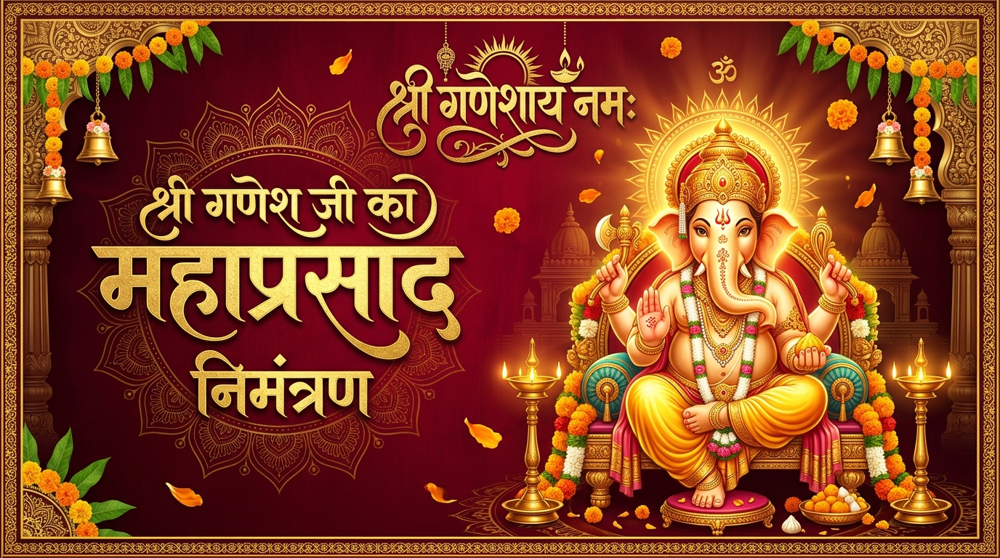

# 🌺 रघुवंशी परिवार श्री गणेश महाप्रसाद डिजिटल आमंत्रण (Raghuwanshi Family Ganesh Mahaprasad Invitation)

A complete, premium, responsive Hindu digital invitation web application crafted in pure Devanagari Hindi for the **Shri Ganesh Mahaprasad (श्री गणेश जी का महाप्रसाद)** organized by **गोकुल जी रघुवंशी (Gokul Ji Raghuwanshi)**.



---

## 🌟 मुख्य विशेषताएँ (Key Features)

- 📜 **पारंपरिक शाही उद्घाटन पर्दा (Sacred Royal Curtain Opening)**: Grand traditional Indian curtain split animation with brass diya, temple bell chime, and golden seal opening experience.
- 🌺 **दिव्य श्री गणेश स्वरूप (Divine Lord Ganesha Artwork)**: Magnificent central devotional visual with glowing halo aura, toran garlands, and hanging brass bells.
- ⏱️ **सटीक उल्टी गिनती (Live IST Countdown Timer)**: High-precision countdown to 21 September 2026, 7:00 PM IST (Asia/Kolkata timezone) with authentic Devanagari numbers and auspicious zero-state message.
- 🌸 **पुष्प वर्षा एवं आशीर्वाद (Interactive Flower Shower)**: Interactive "🌺 पुष्प अर्पित करें" button showering fragrant marigold and rose petals across the screen with devotional blessings.
- 📍 **गूगल मैप्स व आयोजन स्थल (Google Maps & Venue Navigation)**: Embedded interactive venue map and direct 1-click `"📍 मार्ग देखें"` navigation button for *बापू नगर, आपातापा रोड, अकोला*.
- 📅 **कैलेंडर में जोड़ें (Add to Calendar)**: Client-side `.ics` file generator and direct Google Calendar integration.
- 💌 **व्हाट्सऐप आमंत्रण व लिंक साझा (WhatsApp Sharing & Direct Share)**: 1-Click WhatsApp sharing with encoded Hindi invitation text and live URL, copy-link toast, and personalized guest name invite generator.
- 📞 **आयोजक सीधा संपर्क (Direct Host Contact)**: One-click phone calling (`tel:7276300173`) and direct WhatsApp chat with host **गोकुल जी रघुवंशी**.
- 🎵 **मधुर भक्ति संगीत (Devotional Background Audio)**: Ambient devotional music with persistent floating sound toggle (`🔊 / 🔇`) and Web Audio API synthesizer fallback.
- 📱 **100% रिस्पॉन्सिव (Fully Responsive & Mobile-First)**: Optimized for all screen sizes (320px to 4K ultra-wide) and WhatsApp in-app browser viewing.
- 🕉️ **100% शुद्ध हिंदी (Pure Devanagari Hindi)**: Grammatically impeccable Devanagari script with zero broken matras and authentic spiritual aesthetics.

---

## 📅 कार्यक्रम विवरण (Event Information)

| विवरण | जानकारी |
|---|---|
| **मुख्य देव** | 🙏 श्री गणेशाय नमः 🙏 |
| **अवसर** | 🌺 श्री गणेश जी का महाप्रसाद 🌺 |
| **दिनांक** | सोमवार, 21 सितंबर 2026 |
| **समय** | शाम 7:00 बजे से आपके आगमन तक |
| **स्थान** | बापू नगर, आपातापा रोड, अकोला (महाराष्ट्र) |
| **आयोजक** | गोकुल जी रघुवंशी (रघुवंशी परिवार) |
| **संपर्क** | 📞 +91 72763 00173 |

---

## 🛠️ तकनीकी ढांचा (Tech Stack)

- **Frontend**: React 18, Vite 6
- **Styling**: Tailwind CSS v4, Custom Royal Devanagari Theme, Custom Glassmorphism & Gold Gradients
- **Typography**: Google Fonts Devanagari (`Rozha One`, `Yatra One`, `Noto Serif Devanagari`, `Noto Sans Devanagari`, `Poppins`)
- **Audio**: Web Audio API & HTML5 Audio with instant fallback
- **Animations**: CSS Keyframe Physics, Canvas Confetti Petals, 3D Transforms

---

## 🚀 स्थानीय विकास (Local Development)

```bash
# 1. रिपॉजिटरी क्लोन करें
git clone https://github.com/katturwaromkar/Raghuwanshi-Family-Ganpati-Bappa-invitation.git
cd Raghuwanshi-Family-Ganpati-Bappa-invitation

# 2. डिपेंडेंसी इंस्टॉल करें
npm install

# 3. डेवलपमेंट सर्वर शुरू करें
npm run dev
```

ब्राउज़र में `http://localhost:5173` पर खोलें।

---

## 📦 प्रोडक्शन बिल्ड (Production Build)

```bash
# प्रोडक्शन बिल्ड तैयार करें
npm run build

# बिल्ड का पूर्वावलोकन देखें
npm run preview
```

बिल्ड फाइलें `dist/` फोल्डर में जनरेट होंगी।

---

## ☁️ Vercel पर डिप्लॉयमेंट (Deployment to Vercel)

1. [Vercel](https://vercel.com) में लॉगिन करें।
2. **"Add New..."** -> **"Project"** पर क्लिक करें।
3. GitHub रिपॉजिटरी `katturwaromkar/Raghuwanshi-Family-Ganpati-Bappa-invitation` चुनें।
4. Framework Preset: **Vite**
5. **Deploy** पर क्लिक करें। आपका लाइव डिजिटल आमंत्रण तैयार हो जाएगा!

---

## ⚙️ आमंत्रण विवरण कैसे बदलें (How to Customize Details)

सभी आमंत्रण विवरण, दिनांक, समय, फोन नंबर और स्थान एक ही केंद्रीय फाइल में सुरक्षित हैं:
📁 [`src/data/invitation.js`](src/data/invitation.js)

```javascript
export const invitationData = {
  devotionalHeading: "🙏 श्री गणेशाय नमः 🙏",
  title: "गणेश जी का प्रसाद एवं महाप्रसाद",
  dateText: "सोमवार, 21 सितंबर 2026",
  timeText: "शाम 7 बजे से आपके आगमन तक",
  locationText: "बापू नगर, आपातापा रोड, अकोला",
  targetTimestampISO: "2026-09-21T19:00:00+05:30",
  organizerName: "गोकुल जी रघुवंशी",
  phone: "7276300173",
  ...
};
```

---

## 🌸 भक्तिमय शुभकामनाएँ

> **वक्रतुण्ड महाकाय सूर्यकोटि समप्रभ।**  
> **निर्विघ्नं कुरु मे देव सर्वकार्येषु सर्वदा॥**  
>  
> **🙏 गणपति बप्पा मोरया! मंगलमूर्ति मोरया! 🙏**
